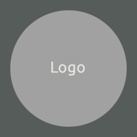
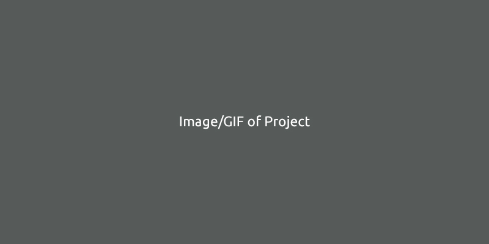
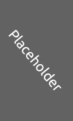

    

<h2 align="center">
    Project Title
</h2>

    A short 1-2 sentence description of the project.

    

# 
## Table of Contents

- [About](#About)
    - [Description](#Description)
    - [Key Features](#Key-Features)
    - [Screenshots](#Screenshots)
- [Getting Started](#Getting-Started)
    - [Requirements](#Requirements)
    - [Installation](#Installation)
    - [How to Use](#How-to-Use)
    - [API](#API)
- [Contributing](#Contributing)
- [License](#License)
- [Links](#Links)
- [Support](#Support)

# 
## About
- ### Description
    Author : Callum Bindley
     Version : 2019.12.22
     Languages Used : HTML, CSS, JavaScript, etc
        
    A full description of the project in long form. 
    Lorem ipsum dolor sit amet, consectetur adipiscing elit. Sed a justo elit. Sed scelerisque consectetur rutrum. Vestibulum erat ante, tincidunt quis porttitor vitae, efficitur non massa. Morbi pharetra tempus lacus. Nunc efficitur ante erat, id sodales est rhoncus sollicitudin. Nullam eget magna vel dolor mattis iaculis. Morbi sit amet magna est. Sed interdum eu nisl ut gravida. Maecenas nec lectus quis lorem convallis semper.
	
- ### Key Features
    Lorem ipsum dolor sit amet, consectetur adipiscing elit.
     Lorem ipsum dolor sit amet, consectetur adipiscing elit.
     Lorem ipsum dolor sit amet, consectetur adipiscing elit.
     Lorem ipsum dolor sit amet, consectetur adipiscing elit.
- ### Showcase
    Examples of the project such as screenshots, links, gifs, video.

    <table>
        <tr>
            <td>
                
            </td>
            <td>
                
            </td>
            <td>
                
            </td>
            <td>
                
            </td>
            <td>
                
            </td>
            <td>
                
            </td>
        </tr>
    </table>

#	
## Getting Started
- ### Requirements
    any required software or version

- ### Installation
    Description of steps required to get project to run

- ### How to Use
    Description of how to use the project with demonstrated examples.
    Where possible use a gif or link to a video showing it. 

- ### API
    Description of how to use the API

# 
## Contributing
Please take a look at our [contributing](CONTRIBUTING.md) guidelines if you're interested in helping!

# 
## License
This project is free to use under the terms of the [MIT](LICENSE.md) license.

# 
## Links
- [Awesome README](https://github.com/matiassingers/awesome-readme)

# 
## Support

 
 

